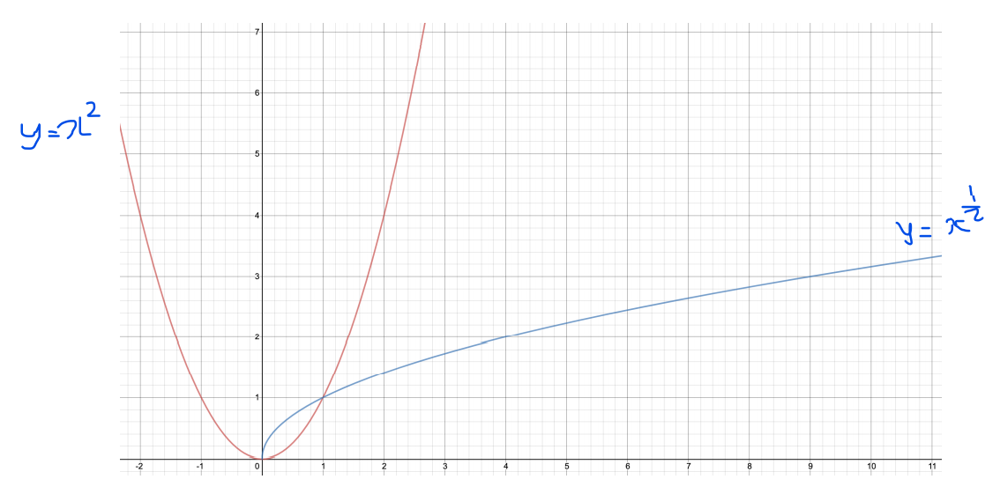

# Part 3. 딥러닝 Overview

## 02. 좋은 인공지능이란

- 인공지능 모델이란?
  - x가 주어졌을 때, y를 반환하는 함수  y = f(x)
  - 파라미터(weight parameter): f가 동작하는 방식을 결정
  - 모델: 알고리즘 자체 또는 파라미터
- 좋은 인공지능 모델이란?
  - 일반화(Generalization)를 잘하는 모델

## 03. 용어 설명

목표 : 주어진 데이터에 대해서 결과를 내는 가상의 함수를 **모사**하는 함수를 만드는 것

### 문제 정의

- 가장 중요한 단계
- 풀고자 하는 문제를 단계별로 나누고 simplify하여야 한다.
- 신경망이라는 함수에 넣기 위한 x와 결과값 y가 정의되어야 한다.

### 데이터 수집

- 문제의 영역에 따라 수집 방법이 다름
- 필요에 따라 레이블링(labeling) 작업 수행

### 데이터 전처리 및 분석

- 탐험적 분석(EDA) 필요
  - 컬럼 간의 관계가 선형 관계/비례 관계/독립적인지, 값의 분포가 어떠하며 스케일링은 어떻게 할지, 어떠한 특징을 가져서 어떤 모델을 사용하는 것이 좋은지
  - NA값 처리, 필요 없는 데이터 삭제, 스케일 형태 결정
- 데이터 증강(augmentation)이 수행

### 알고리즘 적용

- 데이터에 대해 가설을 세우고, 알고리즘(모델) 적용

### 평가

- 쉽거나 어렵기만 해서 판별력이 떨어지는 테스트 데이터 셋 X
- 실제 데이터와 가장 가깝게 구성
- 정량적 평가와 정성적 평가로 나뉨

### 배포

- 학습과 평가가 완료된 모델 weights 파일을 배포
- 장고나 플라스크와 같은 RESTful API를 통해 wrapping 후 배포
- 데이터 분포의 변화에 따른 모델 업데이트 및 유지/보수 필요 ⇒ 처음 모델 작성 시 쉽게 유지 보수 가능하게끔 고려하며 작성

## 04. Appendix Basic Math

### 지수와 로그

#### 지수 함수  

$$
y = x^2
$$

![]

#### 로그함수

### Sum

$$
\sum_{i=0}^N x_i
$$

### Product

$$
\Pi_{i=0}^n x_i
$$

### argmax

$$
\hat x = argmax f(x)
$$

