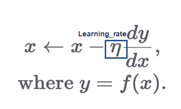
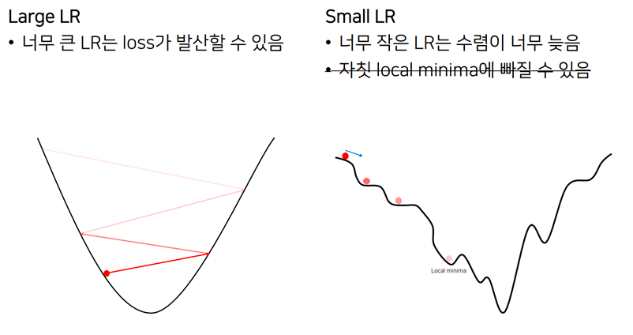

# Part 7. 기초 최적화 방법: Gradient Descent

## 01. Appendix 미분

### 기울기

함수의 두 입력 값에 대한 출력 값의 변화량의 비율

Δy/Δx = y2 - y1/ x2

### 극한(무한소)과 미분

두 점이 가까워질 때의 접선의 기울기

dy/dx = lim f(x+h) - f(x)/(x+h) - x  ( h → 0)

### 도함수

미분 계수를 함수로 일반화

y' = f'(x) = g(x)

### 합성 함수 미분

y = f ㆍg(x) = f(g(x))

y' = f'(g(x))ㆍg'(x)

y = f(h)

h = g(x)

dx/dy = df/dh ㆍ dh/dx = f'(h) ㆍ(d/dx g(x)) = f'(g(x)) ㆍg'(x) (chain rule)

## 02. Appendix 편미분

다변수 함수 : 여러 개의 변수를 입력으로 받는 함수

### 편미분

다변수 x와  y를 입력으로 받는 함수 f를 x로 미분할 경우,

하나의 변수만 남겨놓고 나머지를 상수 취급하는 미분 방법

y값에 대해 뚝 잘랐을 때, x축에 대한 기울기

∂f/∂x = lim f(x+h, y) - f(x,y) / (x + h) - x  (h → 0)

편미분 기호 ∂ : round, partial

### 함수의 입출력 형태

입출력 모두 행렬 또는 벡터로 가능, 동시에도 가능

**스칼라를 벡터로, 스칼라를 행렬로 미분**

→ 각각의 f를 엘리먼트로 미분한 것,  ∇xf

→ 미분 결과는 gradient 벡터가 되어 방향과 크기를 모두 나타냄

**벡터를 스칼라로, 벡터를 벡터로 미분**

→ f 각각 미분하는 데, 경우의 수만큼 미분

## 03. Gradient Descent

> Loss 값을 최소로 하는 Loss Function의 파라미터값을 찾자!

- Loss Function의 도함수에서 **최소값** 찾기(기울기 값이 0이 되는 값)
- 최소가 되는 방향으로 repeated steps로 나아가면서 최소 값의 파라미터값을 찾는다.
- 찾고자하는 파라미터 θ에 대하여 편미분하고 그 값이 0이 되도록 하는 과정을 통해 파라미터 θ를 찾는다.

**learning_rate** : 학습하는 비율, step_size를 정해준다. (0~1 값)

- Global Minima를 찾아야하는데 Local Minima에 빠질 가능성이 있다. 하지만 그렇다고 해서 신경 쓸 요소는 아니다.
- 실제 딥러닝에서는 차원의 수가 많기 때문에 파라미터의 크기가 수백만 단위이다. Loss Function을 상상할 수 없을 정도의 그림이 그려지게 된다. 그래서 수 많은 차원에서 동시에 local minima를 위한 조건이 만족되기는 어렵다.

## 04. Learning rate에 따른 특성

- **learning_rate** : 학습하는 비율, step_size를 정해준다. (0~1 값)

- 중요한 하이퍼파라미터
- 튜닝을 통해 최적화하는 것이 필요
- Adam Optimizer를 사용하면 고민하지 않아도 된다.

## 05. Gradient Descent 구현

jupyter notebook으로 실행

## 06. PyTorch AutoGrad 소개

jupyter notebook으로 실행

