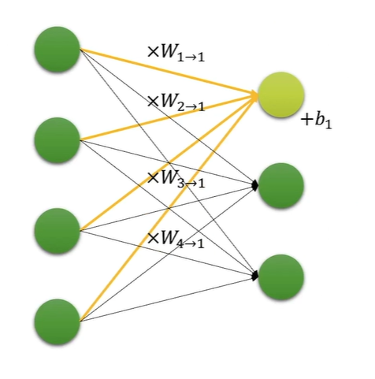

# Part 5. 신경망의 기본 구성요소 살펴보기


## 01. 행렬 곱

*값보다는 shape를 알자!*

**행렬 X 행렬**

|A| = (2,3), |B| = (3,2) 이면, |AB| = (2,2)

**벡터 X 행렬**

|VT| = (1,3), |M| = (3,2) and |VTM| = (1,2)

**행렬 X 벡터**

|M| = (3,2), |v| = (2,) and |Mv| = (3,1)

**텐서 X 텐서**

같은 갯수의 행렬 쌍들에 대해서 병렬로 행렬 곱 실행

(N, n, h) X (N, h, m) = (N, n, m) ⇒ N, h가 서로 같아야 함

```python
z = torch.bmm(x,y)
```


## 02. 실습 행렬 곱

jupyter notebook으로 실행


## 03. Linear Layer

- 신경망의 가장 기본 구성 요소
- Fully-connected Layer or FC Layer
- weight parameter(내부 파라미터)에 따른 **선형 변환**을 수행하는 함수



12개의 W, 3개의 b

- x를 미니배치에 관계 없이 단순히 벡터로 볼 경우

  y = f(x) = WT X x + b

  where |x| = (n, ), |WT| = (m, n), |b| = (m, ) and |y| = (m, )

- x를 미니배치(N개) 텐서로 표현할 경우

  y = f(x) = x X W + b

  where |x| = (N X n), |W| = (n, m), |b| = (m, ) and |y| = (N, m)


## 04. 실습 Linear Layer

jupyter notebook으로 실행


## 05. 실습 GPU 사용하기

jupyter notebook으로 실행